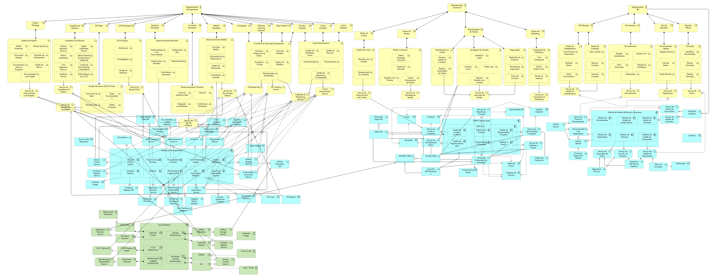

# Roadmap de Transformação Digital - Enterprise Architecture

**Cadeira:** Empresa Digital (Mestrado em Engenharia Informática, ramo SI)
**Tipo de trabalho:** Projeto de grupo (3 elementos)
**Empresa em estudo:** Present Technologies (empresa portuguesa de desenvolvimento de software, caso de estudo público)

## Objetivo

Conceção de uma arquitetura empresarial alvo (TO-BE) e de um roadmap de transformação digital para uma organização de média dimensão do setor tecnológico, a partir da análise da sua arquitetura atual (AS-IS), cobrindo as camadas de negócio, aplicação e tecnologia, com recurso a modelação em ArchiMate.

## A minha contribuição

Fiquei responsável pela componente analítica e de redação do projeto:

- Enquadramento da transformação digital e caracterização do setor de atividade da organização
- Análise crítica da arquitetura AS-IS - identificação de limitações estruturais como o elevado acoplamento entre camadas, a fragmentação do portfólio aplicacional e a ausência de governação arquitetural explícita
- Definição dos princípios da arquitetura TO-BE (orientação a capacidades de negócio, separação negócio/aplicação/tecnologia, modularidade, cloud-native, governação e dados como ativo estratégico)
- Elaboração do roadmap de transformação faseado (curto, médio e longo prazo)

A modelação do diagrama ArchiMate (camadas de negócio, aplicação e tecnologia) foi realizada por outro elemento do grupo - a imagem abaixo está incluída como referência visual do artefacto produzido pela equipa.

## Conceitos aplicados

Arquitetura Empresarial · ArchiMate · Modelação AS-IS/TO-BE · Transformação Digital · Alinhamento estratégico
